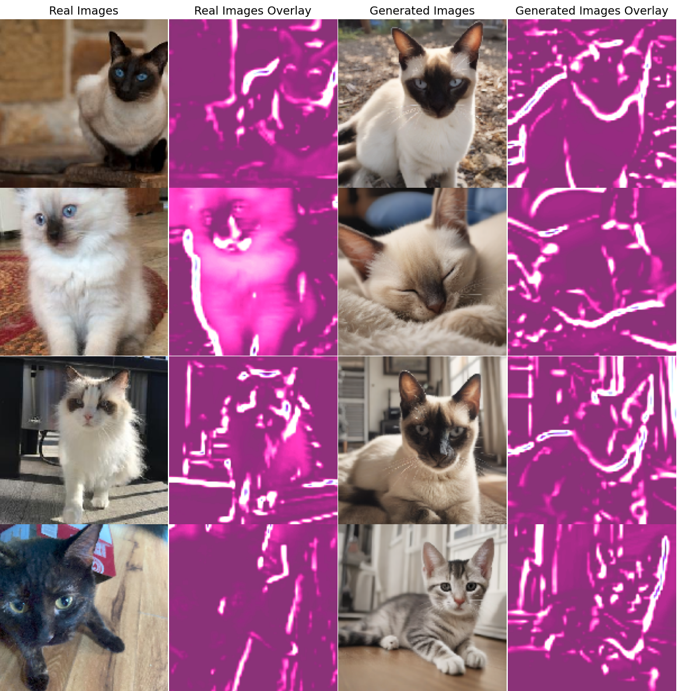
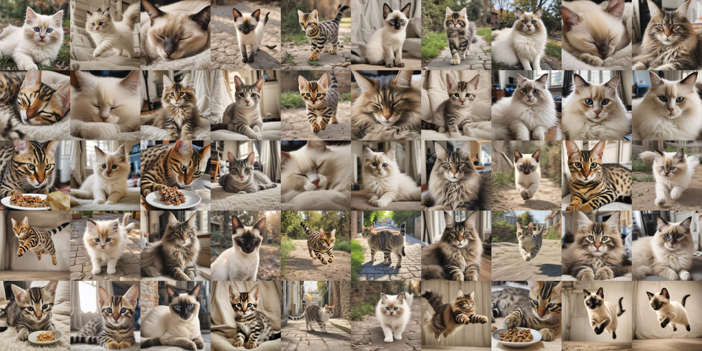
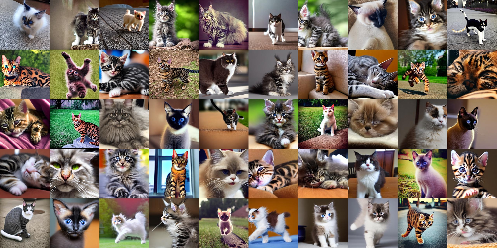
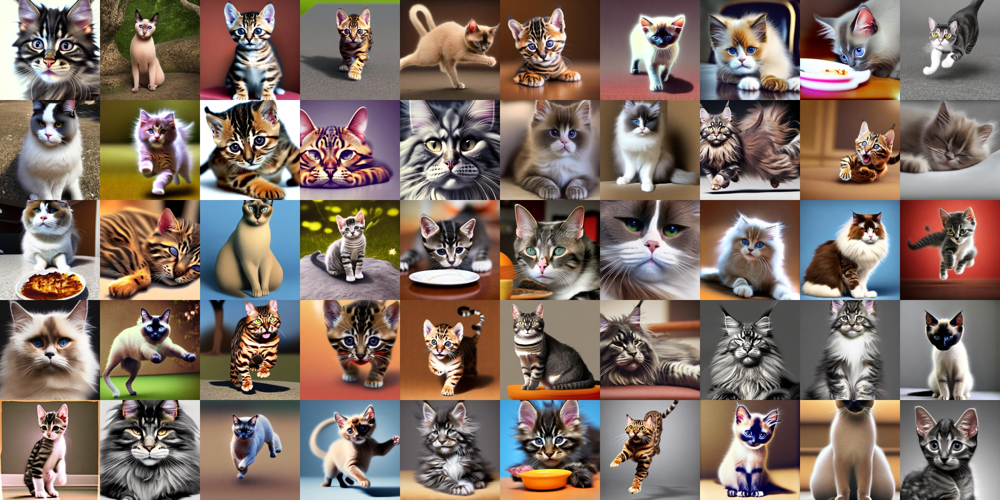
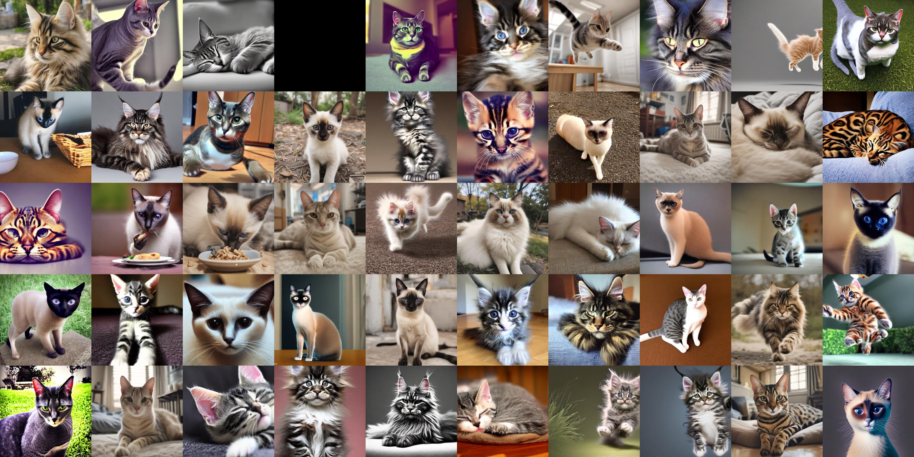
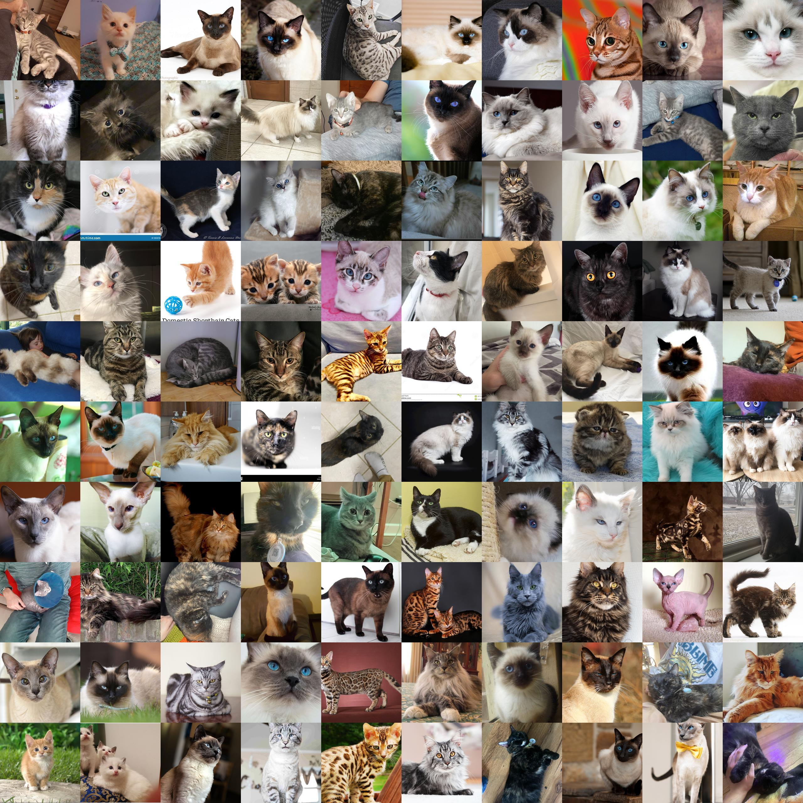

# CorCC
Cat or CopyCat: A Study in Differentiating AI-Generated from Real Cat Images

In recent years, the proliferation of artificial intelligence (AI) and machine learning technologies has led to
remarkable advancements in various fields, including image synthesis and classification. With the advent of
generative adversarial networks (GANs), diffusion models, and other sophisticated AI models, the generation
of realistic images, including those of cats, has become increasingly feasible. However, alongside these
advancements comes the challenge of discerning between AI-generated images and authentic photographs.
This project is a study in differentiating AI-generated cat images from real ones. Leveraging state-of-the-
art deep learning techniques, I aim to develop robust classification models capable of accurately distinguishing
between synthetic and genuine cat images. The ability to reliably identify AI-generated content has significant
implications across diverse domains, including cybersecurity, content moderation, and intellectual property
protection.
Building upon existing research in this domain, particularly the paper titled ”CIFAKE: Image Classifi-
cation and Explainable Identification of AI-Generated Synthetic Images” by Bird and Lotfi [1], we continue
the investigation to further enhance the classification performance and interpretability of our models. By
extending and refining the methodologies proposed in prior studies, I seek to contribute valuable insights
and advancements to the field of AI-generated image detection.
Through rigorous experimentation and analysis, I endeavor to develop models that not only achieve high
accuracy in classifying cat images but also provide interpretable explanations for their predictions. Our
ultimate goal is to empower internet users with effective tools for identifying and mitigating the proliferation
of AI-generated synthetic content, thereby fostering trust, transparency, and security in the digital landscape

## Project Paper

The paper can be found here: https://www.overleaf.com/read/pyrkqwfbqdnp#09ae1c

## Image Generation
The colab used to create all generated images used can be found:

CorCC_GEN: https://colab.research.google.com/drive/1QlsN7vsGlMlkRQg6giMPYJMeVoB5vguO?usp=sharing

800 images were generated for each generative model each following the promting done in the CIFAKE paper with some alteration to better produce cat images. Exact prompts listed in the colab and in the linked paper. 

## Image Prepreation

The colab used to preproccess and manage the images can be found:

CorCC_PREP: https://colab.research.google.com/drive/1-ry-Mijj5z0zUPDdAmmkUB_vHMcWH4zJ?usp=sharing

## SDXL-Turbo vs Real Cat Image Model

The colab for the SDXL-Turbo vs Real Cat Image Model and the first model tested:

CorCC_SDXL-T: https://colab.research.google.com/drive/14rFyOrRcS_h9gdeNgPu6JgyfkivHqtbf?usp=sharing

## SD-v1.5 vs Real Cat Image Model

The colab for the SD-v1.5 vs Real Cat Image Model/Dataset:

CorCC_SDv1.5: https://colab.research.google.com/drive/1-bo87PBu3V3B8BcwKSvylkMX52oD6T78?usp=sharing

## Openjourney-v.4 vs Real Cat Image Model

The colab for the Openjourney-v.4 vs Real Cat Image model can be found:

CorCC_OpenJ: https://colab.research.google.com/drive/1r4nl7GuQM3XfNlMX1iFLZYZxy67xj3wR?usp=sharing

## Combined Generative Method vs Real Cat Image Model

The colab for the Combined Generative Method vs Real Cat Image Model can be found:

https://colab.research.google.com/drive/1nSzlImKqshrwo1lAQyhcVkZdPdb7IjmK?usp=sharing

## Real Cat Image Dataset

The real dataset consists of 1107 mixed images conisting of images from the cat breed dataset by YAPWH (https://www.kaggle.com/datasets/yapwh1208/cats-breed-dataset), images of my girlfriend's cats, and images of my own. There are examples of noise in the dataset. A handful of images contain more than 1 cat, a human, or other distracting features in the image. However, the dataset primarily consists of images of singular cats with varied backgrounds.

